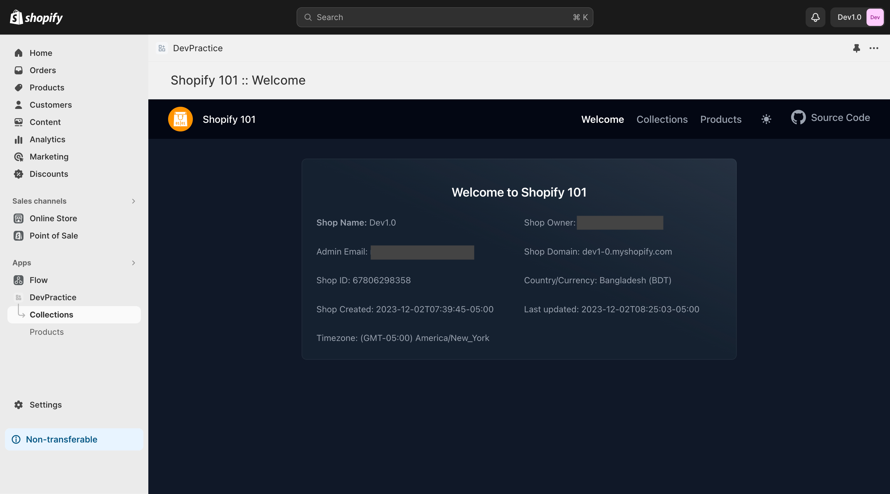
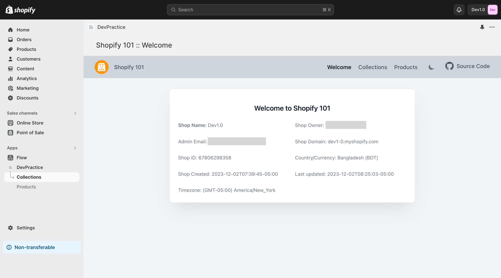
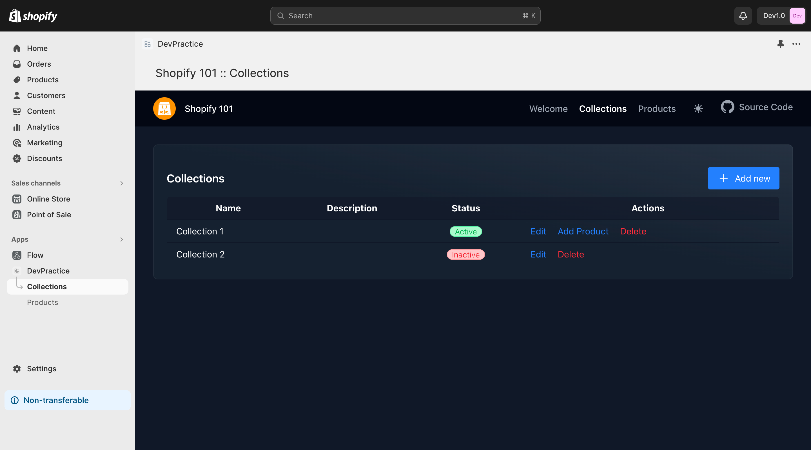
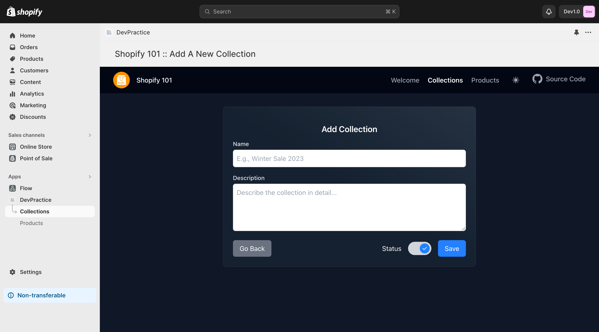
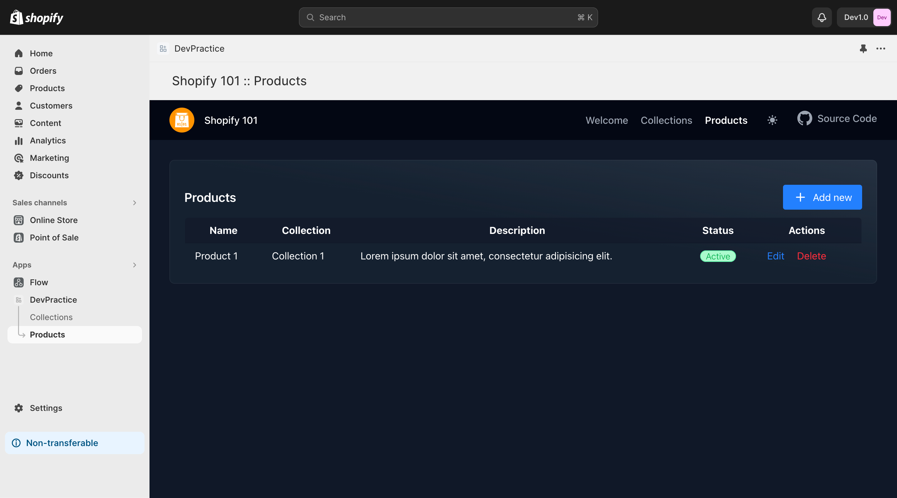
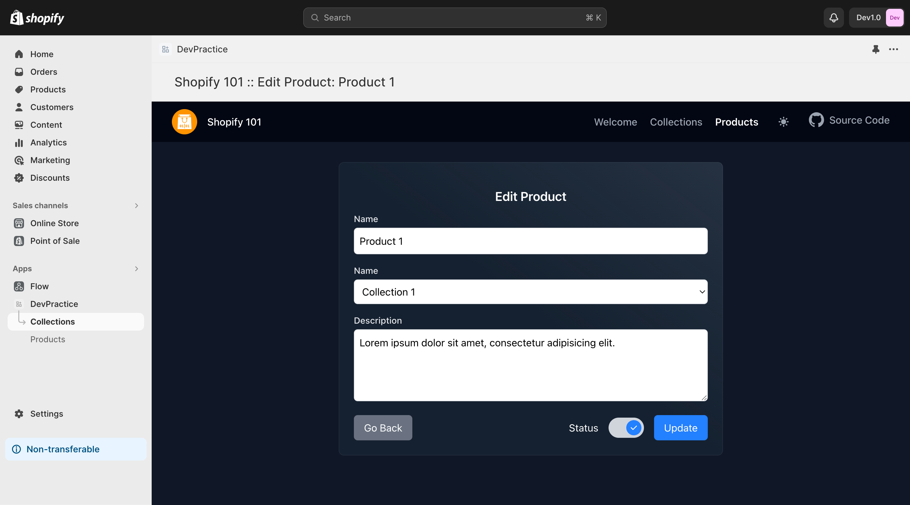

## Shopify 101

### Install

 - Clone this repository or download
 - copy .env.example as .env
   - add host, database config, shopify api keys & scopes
 - run migration
 - update shopify app (App URL & Allowed redirection URL(s) )

### Features added

 Added Shop info (welcome) page & 2 CRUD as requested & navigation menu with app-bridge.
 - Collections (Name, Description, Status)
 - Products (Name, Description, Status, Collection)

### Extra
 - Tailwind
 - Dark mode

### Screenshots

